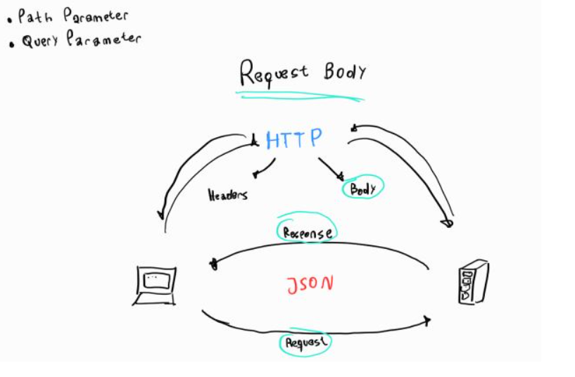
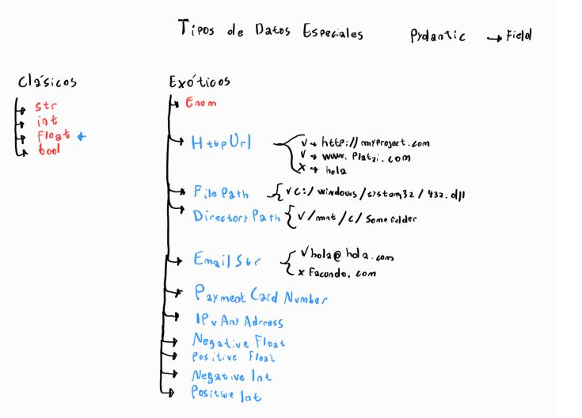
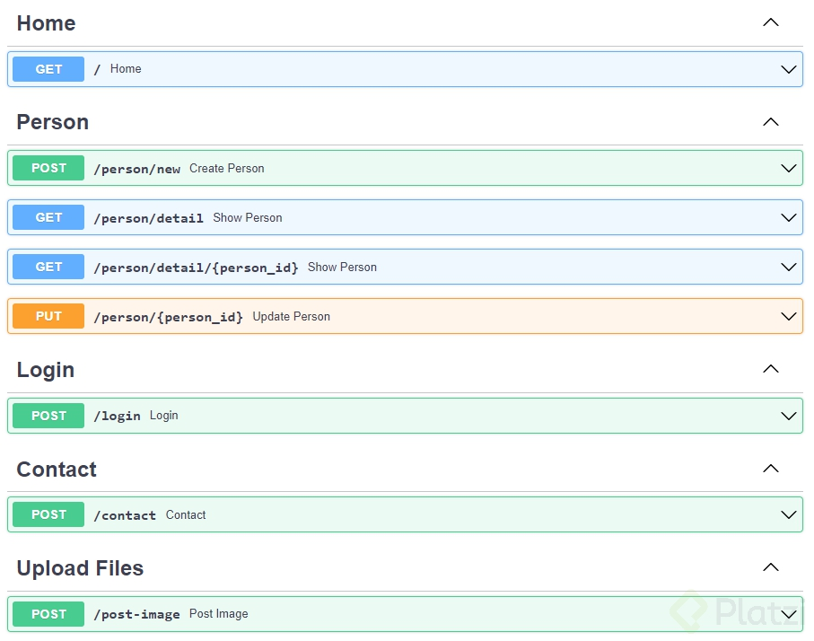
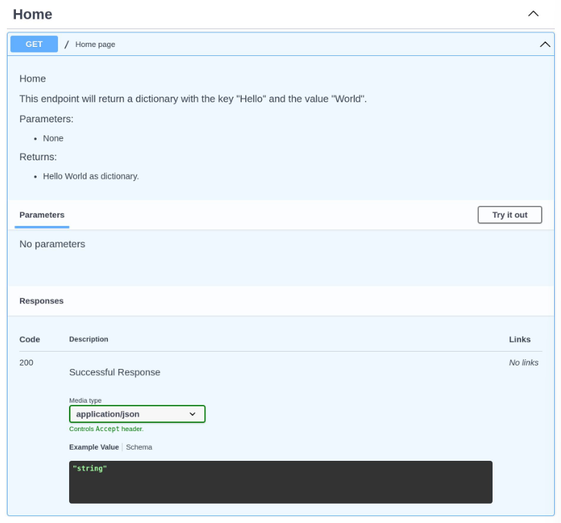
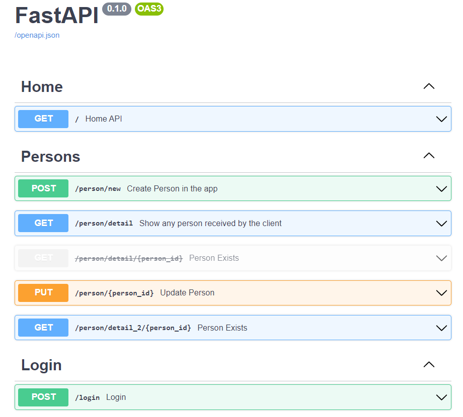

## Fast Api - Python: Montando un servidor api rest con Python

**Fast Api: Framework de Python** que te permite crear backend. Particularmente API´s (Application Program Interface), es el mas rápido en lo que respecta a la velocidad del servidor superando a Node.Js y a GO.

Ubicación de FastAPI en el ecosistema de Python
FastAPI utiliza otros frameworks dentro de si para funcionar

- **Uvicorn**: es una librería de Python que funciona de servidor( puede ser una computadora que funciona como servidor, así como también una librería que permite que una computadora funcione como servidor. Uvicorn es de un servidor del segundo tipo), es decir, permite que cualquier computadora se convierta en un servidor
- **Starlette**: es un framework de desarrollo web de bajo nivel, para desarrollar aplicaciones con este requieres un amplio conocimiento de Python, entonces FastAPI se encarga de añadirle funcionalidades por encima para que se pueda usar mas fácilmente
- **Pydantic**: Es un framework que permite trabajar con datos similar a pandas, pero este te permite usar **modelos** los cuales aprovechara FastAPI para crear la API

**Extra: Diferencias entre "Librerías" y "Frameworks":** 

En el contexto de la programación en Python, existen diferencias significativas entre una librería y un framework. A continuación, te explico cada uno de ellos:

**Librería**:

- Una librería en Python es un conjunto de funciones, módulos y clases que proporcionan una funcionalidad específica que puede ser reutilizada en diferentes proyectos.
- Las librerías están diseñadas para abordar tareas específicas y ofrecer una gama de funciones y herramientas para facilitar el desarrollo de software.
- Los programadores pueden importar y utilizar partes o la totalidad de una librería en sus programas para aprovechar las funciones predefinidas que ofrecen.
- Ejemplos de librerías populares en Python incluyen NumPy (para cálculos numéricos), pandas (para análisis de datos), Matplotlib (para visualización de datos) y requests (para realizar solicitudes HTTP).

**Framework**:

- Un framework en Python es un conjunto de herramientas, componentes y reglas predefinidas que proporcionan una estructura para el desarrollo de aplicaciones.
- A diferencia de una librería, que se utiliza para realizar tareas específicas, un framework ofrece una estructura más amplia y abarca todo el flujo de trabajo de una aplicación.
- Un framework define la arquitectura básica y las convenciones de diseño que deben seguir los programadores al desarrollar una aplicación en particular.
- Los desarrolladores deben escribir su código dentro del marco establecido por el framework y utilizar las funcionalidades proporcionadas por él.
- Ejemplos de frameworks populares en Python incluyen Django (para desarrollo web), Flask (para desarrollo web más liviano), y TensorFlow (para aprendizaje automático y redes neuronales).

En resumen, una librería proporciona funcionalidades específicas que se pueden utilizar en un proyecto, mientras que un framework ofrece una estructura más completa y reglas predefinidas para desarrollar aplicaciones. Las librerías son componentes modulares que se pueden utilizar en diferentes contextos, mientras que los frameworks son estructuras más completas para desarrollar aplicaciones en un dominio específico.

----------------------------------

Creación de entorno de desarrollo en para trabajar con fastapi:

1- Creación de un virtual environment:

```bash
python3 -m venv venv
```

2- Activación del venv:

```bash
source venv/bin/activate
```

3- Instalación de dependencias:

```bash
pip install fastapi uvicorn
```

4- Registro de las dependencias instaladas:

```bash
pip freeze > requirements.txt
```

Una vez programada nuestra API como hicimos en fast-api-hello-world entonces podemos encender el servidor y dejarlo encendido y registrando los cambios con el siguiente comando: 

```bash
uvicorn main:app --reload
```

----------------------------------

## Documentación interactiva de una API con FastAPI:

El framework de base ya documenta de forma automatica y correcta nuestra API haciendo algunos ajustes: 

FastAPI también está parado sobre los hombros de OpenAPI, el cual es un conjunto de reglas que permite definir cómo describir, crear y visualizar APIs. Es un conjunto de reglas que permiten decir que una API está bien definida.

OpenAPI necesita de un software, el cual es Swagger, que es un conjunto de softwares que permiten trabajar con APIs. FastAPI funciona sobre un programa de Swagger el cual es Swagger UI, que permite mostrar la API documentada.

Acceder a la documentación interactiva con Swagger UI:

```bash
http://{localhost}/docs // http://127.0.0.1:8000//docs
```

Acceder a la documentación interactiva con Redoc:

```bash
http://{localhost}/redoc // http://127.0.0.1:8000//redoc
```

-------------------------------------------------

## Path Operations

Ejemplo en nuestro codigo: 

```python
@app.get("/") # Path operation decorator
def home(): # Path operation function
    return {"Hello": "world"} # Path operation function
```

Un **path** es lo mismo que un **route** o **endpoints** y es todo aquello que vaya después de nuestro dominio a la derecha del mismo.

¿Que son las operations?

Un **operations** es exactamente lo mismo que un **método http** y tenemos las siguientes más populares:

- GET
- POST
- PUT
- DELETE

Y otros métodos como OPTIONS, HEAD, PATCH

- Options:
Devuelve un header adicional llamado allow que contiene los metodos http que pueden utilizarse en ese endpoint.

- Head:
Devuelve info sobre el documento, mas no el documento en si.

- Patch:
Hacer modificaciones parciales al documento a diferencia de put que permite cambiar el documento entero.

- Trace:
Nos permite observar que esta pasando en la peticion y nos devuelve nuestro input con propositos de debugging.


--------------------------------------

## Path Parameters:

https://fastapi.tiangolo.com/tutorial/path-params/

Los **parámetros de ruta** son partes **variables** de una ruta URL . Por lo general, se utilizan para señalar un recurso específico dentro de una colección, como un usuario identificado por ID. Una URL puede tener varios parámetros de ruta.

```python
from fastapi import FastAPI

app = FastAPI()


@app.get("/items/{item_id}") # Path parameter
async def read_item(item_id):
    return {"item_id": item_id}
```


--------------------------------------

## Query Parameters: 

https://fastapi.tiangolo.com/tutorial/query-params/

Query parameters: son un conjunto definido de parámetros adjuntos al final de una URL . Son extensiones de la URL que se utilizan para ayudar a definir contenido o acciones específicos en función de los datos que se transmiten.

```python
@app.get("/users/{user_id}/details?age=20&height=184) # Detras de "?" están los query parameteres
```


--------------------------------------

## Request Body & Response Body:

HTTP = Hyper Text Transfer Protocol

Se ejecutan ambos, Request Body y Response Body en JSON

Documentacion: https://fastapi.tiangolo.com/tutorial/body/

Un Request Body son datos enviados por el cliente a su API.

Un Response Body son los datos que su API envía al cliente.



--------------------------------------------

## Models. O como construimos nuestras entidades que luego vamos a registrar en base de datos.

Modelo -> Entidad -> Clase

Modelo no es nada mas que la representación de una entidad en código al menos de manera descriptiva.

Entidades en Twitter:

1- Tweet
2- Usuarios

Si creamos una API de Tweeter deberiamos crear dos modelos al menos. Uno para Tweet y una para Usuarios. 

Esto lo vamos a hacer con "Pydantic" y su clase BaseModel que es la librería que nos permite construir modelos en Python.

Documentacion Oficial: https://fastapi.tiangolo.com/tutorial/sql-databases/

¿Como luce un modelo dentro de FastAPI?

Modelo pydantic para validar datos:

```python
from typing import List, Optional

from pydantic import BaseModel


class ItemBase(BaseModel):
    title: str
    description: Optional[str] = None


class ItemCreate(ItemBase):
    pass


class Item(ItemBase):
    id: int
    owner_id: int

    class Config:
        orm_mode = True


class UserBase(BaseModel):
    email: str


class UserCreate(UserBase):
    password: str


class User(UserBase):
    id: int
    is_active: bool
    items: List[Item] = []

    class Config:
        orm_mode = True
```

Un modelo para mapear los datos a la base de datos (ORM, SQLalchemy)

```python
from sqlalchemy import Boolean, Column, ForeignKey, Integer, String
from sqlalchemy.orm import relationship

from .database import Base


class User(Base):
    __tablename__ = "users"

    id = Column(Integer, primary_key=True, index=True)
    email = Column(String, unique=True, index=True)
    hashed_password = Column(String)
    is_active = Column(Boolean, default=True)

    items = relationship("Item", back_populates="owner")


class Item(Base):
    __tablename__ = "items"

    id = Column(Integer, primary_key=True, index=True)
    title = Column(String, index=True)
    description = Column(String, index=True)
    owner_id = Column(Integer, ForeignKey("users.id"))

    owner = relationship("User", back_populates="items")
```

-----------------------------------------------

## Validaciones: Query Parameters

Es necesario validar que los Query Parameters cumplan con determinadas caracteristicas para que no rompan nuestro modelo y nuestra API. Esto se hace de la siguiente forma: 

```python
#Python
from typing import Optional

#FastAPI
from fastapi import FastAPI
from fastapi import Body, Query

app = FastAPI()

@app.get("/person/detail")
def show_person(
    name: Optional[str] = Query(None, min_length=1, max_length=50),
    age: Optional[str] = Query(...)
): 
    return {name: age}
```

Validaciones de Query Parameters:

Validar strings:

- max_length
- min_length
- regex

Validar numeros:

- ge = greater or equal than = >=
- le = less or equal than = <=
- gt = greater than = >
- lt = less than = <

Parametros de Query parameters descriptivos e informativos o parametros para documentación:

- Title
- Description

-----------------------------------

## Validaciones: Path Parameters:

Las validaciones pueden realizarse sobre los query parameters como vimos arriba o también pueden realizarse sobre los path parameters como en este ejemplo: 

```python
#Pydantic
from pydantic import BaseModel

#FastAPI
from fastapi import FastAPI
from fastapi import Path

app = FastAPI()

# Validaciones: Path Parameters

@app.get("/person/detail/{person_id}")
def show_person(
    person_id: int = Path(..., gt=0)
): 
    return {person_id: "It exists!"}
```

----------------------------------------

## Validaciones: Request Body:

También podemos validar el contenido del Request Body...

```python
#Pydantic
from pydantic import BaseModel

#FastAPI
from fastapi import FastAPI
from fastapi import Path

app = FastAPI()

# Validaciones: Request Body

@app.put("/person/{person_id}")
def update_person(
    person_id: int = Path(
        ...,
        title="Person ID",
        description="This is the person ID",
        gt=0
    ),
    person: Person = Body(...),
    location: Location = Body(...)
): 
    results = person.dict()
    results.update(location.dict())
    return results
```

Para lograr una validación de los request body a nivel de los distintos atributos que tiene cada clase del request vamos a tener
que realizar validaciones en el modelo como veremos a continuación. Acá solo podremos validar que clases queremos recibir en el body de nuestra request

--------------------------------------

## Validaciones: Models

Las validaciones en el Modelo se realizan directamente en la construcción de las clases del modelo mismo. 

```python
#Python
from typing import Optional
from enum import Enum

#Pydantic
from pydantic import BaseModel
from pydantic import Field

#FastAPI
from fastapi import FastAPI
from fastapi import Body, Query, Path

app = FastAPI()

# Models

class HairColor(Enum): 
    white = "white"
    brown = "brown"
    black = "black"
    blonde = "blonde"
    red = "red"

class Location(BaseModel): 
    city: str
    state: str
    country: str

class Person(BaseModel): 
    first_name: str = Field(
        ..., 
        min_length=1,
        max_length=50,
        example="Miguel"
        )
    last_name: str = Field(
        ..., 
        min_length=1,
        max_length=50,
        example="Torres"
        )
    age: int = Field(
        ...,
        gt=0,
        le=115,
        example=25
    )
    hair_color: Optional[HairColor] = Field(default=None, example=HairColor.black)
    is_married: Optional[bool] = Field(default=None, example=False)

    # class Config: 
    #     schema_extra = {
    #         "example": {
    #             "first_name": "Mariano",
    #             "last_name": "Gobea Alcoba",
    #             "age": 35, 
    #             "hair_color": "blonde",
    #             "is_married": True
    #         }
    #     }

@app.get("/")
def home(): 
    return {"Hello": "World"}
```

------------------------------------------

## Validacion de tipos de datos especiales.

Docu oficial: https://pydantic-docs.helpmanual.io/usage/types/#pydantic-types

Por ejemplo, podemos validar que un email sea realmente un email o que una contraseña tenga un formato admitido para contraseña, etc

Todas estas validaciones se importan de Pydantic

```python
from pydantic import HttpUrl, FilePath, DirectoryPath, EmailStr, PaymentCardNumber, IPvAnyAddress, NegativeFloat, PositiveFloat, NegativeInt, PositiveInt 
```



----------------------------------------------

## Formas para cargar valores por defecto en nuestros request

1- class Config

2- parametro "example" dentro de cada Field()

------------------------------------------------

## Formas de cargar valores por defecto para los Paths y los Query Parameters

Las clases Query() y Path() tienen exactamente el mismo parametro para agregar ejemplos que Field(). Es decir el parametro "example"

Con estos recursos ya tendremos los parametros del Path, las Querys y el Body precargados para probar nuestros endpoints desde la documentación automatica de FastAPI.

--------------------------------------------
--------------------------------------------

# FastApi: MOdularización, Datos, Errores:

## Response Model:

Nos permite modelar la respuesta que le damos al cliente frente a un post por ejemplo, para no devolver datos sensibles que puedan implicar un problema de seguridad. 

Por ejemplo si el cliente nos envía una contraseña entre sus datos nunca deberíamos devolver la misma.

El response model va en el decorator. No en la function.

```python
# Request and Response Body
# Al declarar un response model en mi decorator no necesito modificar la variable que retorno en mi func.
# Clase de pydantic creada para mí response model.
class PersonOut(BaseModel):
    first_name: str = Field(
        ...,
        min_length=1,
        max_length=50,
        example="Nicole"
        )
    last_name: str = Field(
        ...,
        min_length=1,
        max_length=50,
        example="Ferandez"
    )
    age: int = Field(
        ...,
        gt=0,
        le=115,
        example=29
    )
    hair_color: Optional[HairColor] = Field(
        default=None,
        example="Blonde"
    )  
    is_married: Optional[bool] = Field(
        default=None,
        example=True
    )

@app.post("/person/new", response_model=PersonOut)
def create_person(person: Person = Body(...)): # Los "..." en Body indican que el Body es obligatorio
    return person # Retorno como response lo mismo que recibí como parametro
```

--------------------------------------------

## Uso de herencia entre clases para limpieza de codigo:

Cuando tenemos clases que repiten atributos y/o métodos, podemos y debemos abstraerlas a un nivel mas alto, otra clase, que tenga todos los atríbutos y métodos compartidos para que luego las clases hijas hereden directamente de ellas. 

Esto nos va a evitar problemas de sincronización de codigo y errores frente a updates futuros. 

Por ejemplo en nuestra API-rest lo que vamos a abstraer y limpiar son las clases de Person y PersonOut creando una nueva clase llamada PersonBase. 

--------------------------------------------

## Status Code: 

Pequeño numero de tres digitos que indica que pasó con la request del cliente. Esos status code deben ser manejados desde el servidor de forma profesional:

Status Code:

Aquí podrán visualizar la totalidad de los status code con hermosas imagenes de gatitos!!! 😻

https://http.cat/

Y aquí tienen información profesional sobre cada uno de los status code: 

https://developer.mozilla.org/es/docs/Web/HTTP/Status

Igualmente voy a dejar un breve resumen sobre cada grupo de status code: 

- Respuestas informativas (100–199),
- Respuestas satisfactorias (200–299),
- Redirecciones (300–399),
- Errores de los clientes (400–499),
- y errores de los servidores (500–599). (Errores de nuestro codigo como Backend Dev´s)

**El manejo profesional de Status Code consiste en que cada una de las "Path Operations" que hemos creado tenga un manejo de Status Code personalizado. Este es el Standar Correcto de trabajo en Backend.**

Para esto vamos a tener que importar otro modulo de fast-api llamado "status".

```python
from fastapi import status
```

"status" de fastapi también se debe declarar y usar dentro de nuestros decoradores como hicimos con "response_model"

-----------------------------------

## Manejo de Formularios o "forms"

Muchas veces los datos que nos envía un cliente no vienen ni en el path, ni en los query parameters ni tampoco en el body de una request. Sino que los mismos son envíados mediante la acción de completar un formulario. El mismo vive en un frontend con el que el cliente interactua y luego hace submit al mismo para enviar los datos a un servidor. 

Por ejemplo los formularios de registración que practicamente cualquier plataforma web tiene para sus usuarios. 

Estos datos cargados por formulario también pueden, y deben ser leidos por fastapi para poder llevar adelante las acciones que cada endpoint tiene asociadaas. Pero para esto necesitamos una librería adicional de python dado que fastapi de por sí no puede trabajar con formularios...

```bash
pip install python-multipart
```

----------------------------------

## Cookies y Header

Son fuentes de datos aún mas exoticas que los path parameters, query parameters, body y forms. Pero también de ellos podemos obtener información relevante. 

**Cookies**

Una pieza de código que un servidor mete en tu computadora cuando estas navegando en la web

**Headers**

Una parte de una petición o respuesta HTTP que contiene datos sobre la petición o la respuesta, como el formato, quien la hizo, el contenido, etc…

Ejemplo en código

```python
@app.post(
    path='/contact',
    status_code=status.HTTP_200_OK
)
def contact(
    first_name: str = Form(
        ...,
        max_length=20,
        min_length=1,
        example='Peter'
    ),
    last_name: str = Form(
        ...,
        max_length=20,
        min_length=1,
        example='Chiguire'
    ),
    email: EmailStr = Form(
        ...,
        example='peterchiguire@gmail.com'
    ),
    message: str = Form(
        ...,
        min_length=20,
        max_length=280,
        example='Hola, estoy interesado en tu proyecto, jajaj xdddd'
    ),
    user_agent: Optional[str] = Header(default=None),
    ads: Optional[str] = Cookie(default=None)
):
    return {
        'first_name': first_name,
        'last_name': last_name,
        'email': email,
        'message': message,
        'user_agent': user_agent,
        'ads': ads
    }
```

Response Body

```json
{
  "first_name": "Peter",
  "last_name": "Chiguire",
  "email": "peterchiguire@gmail.com",
  "message": "Hola, estoy interesado en tu proyecto, jajaj xdddd",
  "user_agent": "Mozilla/5.0 (Windows NT 10.0; Win64; x64) AppleWebKit/537.36 (KHTML, like Gecko) Chrome/94.0.4606.81 Safari/537.36 OPR/80.0.4170.61",
  "ads": null
}
```

--------------------------------------

# Archivos

Muchas veces, no solo queremos recibir datos de tipo strings, int, headers, cookies, etc. Sino que necesitamos recibir fotos, videos, o archivos csv, xls, etc. Para estos casos fastapi también nos permite recibir estos archivos y manejarlos en nuestro servidor. 

**Archivos**

[Request Files - FastAPI](https://fastapi.tiangolo.com/tutorial/request-files/)

Entrada de datos que se refiere a los archivos FastAPI, por ejemplo una imagen o un video, se utilizan dos clases File y UploadFile

**UploadFile**

Esta clase tiene una serie de **parametros**, se refiere a la clase donde se guardará el archivo

**filename**: se refiere al nombre del archivo, con esto tenemos el control sobre el nombre del archivo que suba el cliente a la aplicación.

**content_type**: formato del archivo por ejemplo JPEG, MP4, GIF…

**file**: se refiere al archivo en si mismo, los bytes del mismo

**File**

Hereda de Form y funciona similar a las clases Query, Path y Body, se encarga de guardar los bytes del archivo.

*Ventajas de usar UploadFile en lugar de solo File o Bytes*

El archivo se guardará en la memoria hasta que supere un tamaño máximo, al pasar ese límite se guardara en el disco, esto quiere decir que funciona mucho mejor con archivos grandes sin consumir toda la memoria RAM
Puedes obtener metadata del archivo
funciona como un file-like async interface.
Usa metodo Asincronos como write, read, seek y close

*Repaso de tipos de entradas de datos que tenemos disponibles en FastAPI:*

- Path Parameters
- Query Parameters
- Request Body
- Forms
- Headers
- Cookies
- Files: Se divide en dos: File & UploadFile

--------------------------------------------------

# HTTPException

Clase de FastAPI que nos va a permitir trabajar con los errores al usar nuestra API.

**Manejo de Errores**

Para esto importamos el módulo de FastApi

```python
from fastapi import HTTPException
```

En caso de que se conozca la posibilidad de que haya un error lo ideal es manejarlo por ejemplo en el detail de una persona si el person_id no existe, manejar el error enviando un 404 Not Found, una forma de hacerlo seria

```python
persons = [1, 2, 3, 4, 5]

@app.get(
    path='/person/detail/{person_id}',
    status_code=status.HTTP_200_OK
)
def show_person(
    person_id: int = Path(
        ...,
        gt=0,
        title='Person Id',
        description='Person ID on the Database',
        example=20
    )
):

    if person_id not in persons:
        raise HTTPException(
            status_code=status.HTTP_404_NOT_FOUND,
            detail='Person not found'
        )

    return {person_id: 'it exists!'}
```
------------------------------------------------------

# Comenzando a ordenar nuestra documentación: etiquetas.

Las etiquetas (tags) son un título que aparece en la documentación interactiva para que las path operations estén en un orden correcto.

Para ello se utiliza el parámetro tag en el path operation decorator.

```python
@app.get(
    path='/person/detail',
    status_code=status.HTTP_200_OK,
    tags=['Persons']
    )

@app.post(
    path='/contact',
    status_code=status.HTTP_200_OK,
    tags=['Forms']
)

@app.post(
    path='/post-image',
    tags=['Files']
)
```

Te quedaría una estructura como esta: 



----------------------------------------------

# Nombre y descripción de una path operation

Otra parte importante para documentar nuestras API´s es ponerle nombre y descripción a cada una de nuestras path operations...

Los aspectos para hacer el docstring de las path operations:

- Título
- Descripción
- Parámetros
- Resultado

En python y usando visual studio code podemos generar la estructura de una documentación profesional con docstrings usando la extensión "autoDocstring". Para ello abrimos las triples comillas simples o dobles """ o '''



----------------------------------------------

# Deprecar una path operation. (Dejar sin efecto una path operation)

Dejar de usar una path operation porque:

- Encontramos una mejor forma de hacer las cosas. 
- Vamos a hacer lo mismo pero de una manera distinta. 
- Estamos haciendo una refactorización profunda de nuestro codigo. Esto sucede cuando el codigo es malo y queremos rearmarlo. 

¿Como se hace? 

Muy sencillo: En el path operation decorator vamos a poner un nuevo parametro llamado: "deprecated=True"

Así se ve una path operation deprecada: 



Fin de teoría!!!

------------------------------------

# Inicio de proyecto. API de twitter

Así como existen convenciones para la forma en la que escribimos el código, también existen convenciones para la forma en la que se nombran o se definen las rutas en los endpoints.

Dejo este link con algunas reglas de ejemplo: 

https://restfulapi.net/resource-naming/

**URLs**

Teniendo lo anterior en cuenta, sugiero usar la siguiente estructura: 

**Tweets** (Modelo de pydantic)

- GET /tweets/ -> Shows all tweets
- GET /tweets/{id} -> Shows a specific tweet
- POST /tweets/ -> Creates a new tweet
- PUT /tweets/{id} -> Updates a specific tweet
- DELETE /tweets/{id} -> Deletes a specific tweet

**Authentication**

- POST /auth/signup -> Registers a new user
- POST /auth/login -> Login a user

**Users** (Modelo de pydantic)

- GET /users/ -> Shows all users
- GET /users/{id} -> Gets a specific user
- PUT /users/{id} -> Updates a specific user
- DELETE /users/{id} -> Deletes a specific user


