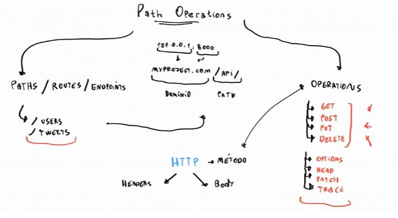
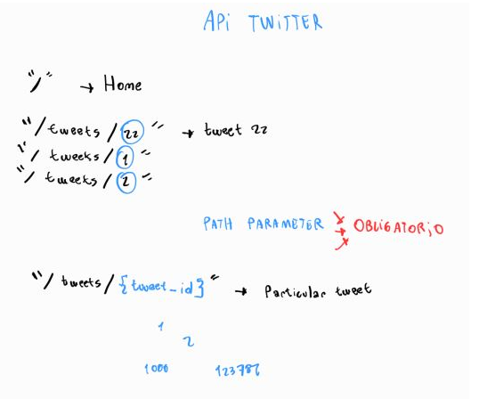

## Fast Api - Python: Montando un servidor api rest con Python

**Fast Api: Framework de Python** que te permite crear backend. Particularmente API´s (Application Program Interface), es el mas rápido en lo que respecta a la velocidad del servidor superando a Node.Js y a GO.

Ubicación de FastAPI en el ecosistema de Python
FastAPI utiliza otros frameworks dentro de si para funcionar

- **Uvicorn**: es una librería de Python que funciona de servidor( puede ser una computadora que funciona como servidor, así como también una librería que permite que una computadora funcione como servidor. Uvicorn es de un servidor del segundo tipo), es decir, permite que cualquier computadora se convierta en un servidor
- **Starlette**: es un framework de desarrollo web de bajo nivel, para desarrollar aplicaciones con este requieres un amplio conocimiento de Python, entonces FastAPI se encarga de añadirle funcionalidades por encima para que se pueda usar mas fácilmente
- **Pydantic**: Es un framework que permite trabajar con datos similar a pandas, pero este te permite usar **modelos** los cuales aprovechara FastAPI para crear la API

**Extra: Diferencias entre "Librerías" y "Frameworks":** 

En el contexto de la programación en Python, existen diferencias significativas entre una librería y un framework. A continuación, te explico cada uno de ellos:

**Librería**:

- Una librería en Python es un conjunto de funciones, módulos y clases que proporcionan una funcionalidad específica que puede ser reutilizada en diferentes proyectos.
- Las librerías están diseñadas para abordar tareas específicas y ofrecer una gama de funciones y herramientas para facilitar el desarrollo de software.
- Los programadores pueden importar y utilizar partes o la totalidad de una librería en sus programas para aprovechar las funciones predefinidas que ofrecen.
- Ejemplos de librerías populares en Python incluyen NumPy (para cálculos numéricos), pandas (para análisis de datos), Matplotlib (para visualización de datos) y requests (para realizar solicitudes HTTP).

**Framework**:

- Un framework en Python es un conjunto de herramientas, componentes y reglas predefinidas que proporcionan una estructura para el desarrollo de aplicaciones.
- A diferencia de una librería, que se utiliza para realizar tareas específicas, un framework ofrece una estructura más amplia y abarca todo el flujo de trabajo de una aplicación.
- Un framework define la arquitectura básica y las convenciones de diseño que deben seguir los programadores al desarrollar una aplicación en particular.
- Los desarrolladores deben escribir su código dentro del marco establecido por el framework y utilizar las funcionalidades proporcionadas por él.
- Ejemplos de frameworks populares en Python incluyen Django (para desarrollo web), Flask (para desarrollo web más liviano), y TensorFlow (para aprendizaje automático y redes neuronales).

En resumen, una librería proporciona funcionalidades específicas que se pueden utilizar en un proyecto, mientras que un framework ofrece una estructura más completa y reglas predefinidas para desarrollar aplicaciones. Las librerías son componentes modulares que se pueden utilizar en diferentes contextos, mientras que los frameworks son estructuras más completas para desarrollar aplicaciones en un dominio específico.

----------------------------------

Creación de entorno de desarrollo en para trabajar con fastapi:

1- Creación de un virtual environment:

```bash
python3 -m venv venv
```

2- Activación del venv:

```bash
source venv/bin/activate
```

3- Instalación de dependencias:

```bash
pip install fastapi uvicorn
```

4- Registro de las dependencias instaladas:

```bash
pip freeze > requirements.txt
```

Una vez programada nuestra API como hicimos en fast-api-hello-world entonces podemos encender el servidor y dejarlo encendido y registrando los cambios con el siguiente comando: 

```bash
uvicorn main:app --reload
```

----------------------------------

## Documentación interactiva de una API con FastAPI:

El framework de base ya documenta de forma automatica y correcta nuestra API haciendo algunos ajustes: 

FastAPI también está parado sobre los hombros de OpenAPI, el cual es un conjunto de reglas que permite definir cómo describir, crear y visualizar APIs. Es un conjunto de reglas que permiten decir que una API está bien definida.

OpenAPI necesita de un software, el cual es Swagger, que es un conjunto de softwares que permiten trabajar con APIs. FastAPI funciona sobre un programa de Swagger el cual es Swagger UI, que permite mostrar la API documentada.

Acceder a la documentación interactiva con Swagger UI:

```bash
http://{localhost}/docs // http://127.0.0.1:8000//docs
```

Acceder a la documentación interactiva con Redoc:

```bash
http://{localhost}/redoc // http://127.0.0.1:8000//redoc
```

-------------------------------------------------

## Path Operations

Ejemplo en nuestro codigo: 

```python
@app.get("/") # Path operation decorator
def home(): # Path operation function
    return {"Hello": "world"} # Path operation function
```

Un **path** es lo mismo que un **route** o **endpoints** y es todo aquello que vaya después de nuestro dominio a la derecha del mismo.

¿Que son las operations?

Un **operations** es exactamente lo mismo que un **método http** y tenemos las siguientes más populares:

- GET
- POST
- PUT
- DELETE

Y otros métodos como OPTIONS, HEAD, PATCH

- Options:
Devuelve un header adicional llamado allow que contiene los metodos http que pueden utilizarse en ese endpoint.

- Head:
Devuelve info sobre el documento, mas no el documento en si.

- Patch:
Hacer modificaciones parciales al documento a diferencia de put que permite cambiar el documento entero.

- Trace:
Nos permite observar que esta pasando en la peticion y nos devuelve nuestro input con propositos de debugging.



--------------------------------------

## Path Parameters:

https://fastapi.tiangolo.com/tutorial/path-params/

Los **parámetros de ruta** son partes **variables** de una ruta URL . Por lo general, se utilizan para señalar un recurso específico dentro de una colección, como un usuario identificado por ID. Una URL puede tener varios parámetros de ruta.

```python
from fastapi import FastAPI

app = FastAPI()


@app.get("/items/{item_id}")
async def read_item(item_id):
    return {"item_id": item_id}
```



--------------------------------------

## Query Parameters: 

https://fastapi.tiangolo.com/tutorial/query-params/

Query parameters: son un conjunto definido de parámetros adjuntos al final de una URL . Son extensiones de la URL que se utilizan para ayudar a definir contenido o acciones específicos en función de los datos que se transmiten.


--------------------------------------


